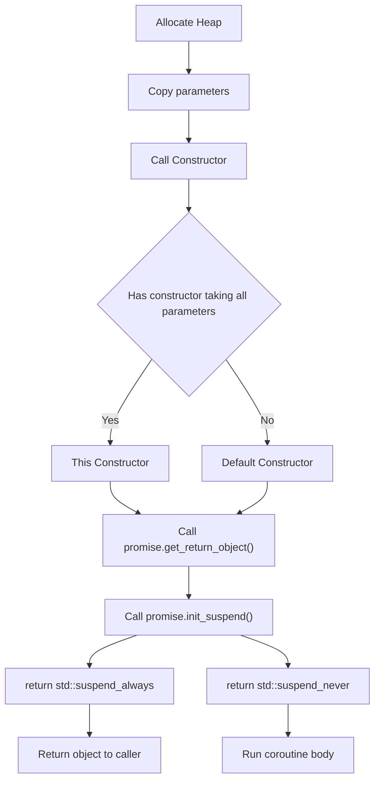

# Coroutine

Corountine, a function that can suspend execution to be resumed later.

Corountine are stackless: they suspend execution by returning to the caller,
and the data is required to be resume execution is stored separately from the stack.

A function is a coroutine if its definition contains any of the following:
- `co_await` -- to suspend execution until resumed.
- `co_yield` -- to suspend execution returning a value.
- `co_return` -- to complete execution returning a value.

## Execution

Each coroutine is associated with
- **the promise object**, manipulated from inside the corountine. The coroutine submits its result or exception through this object.
- **the coroutine handle**, manipulated from outside the coroutine. This is non-owning handle used to resume execution of the coroutine or to destroy the coroutine state.
- **the coroutine state**, which is internal, dynamically-allocated (the allocation can be optimized out), object that contains.
  - the promise object
  - the parameters (all copied by value)
  - some representation of the current suspension point
  - local variables and temporaries whose lifetime spans the current suspension point.

### Initialization Flow
- allocates the coroutine state object using operator new.
- copies all function parameters to the coroutine state: by-value paramters are moved or copied, by-reference parameters remain references.
- calls the constructor for the promise object. If the promise type has a constructor that taks all coroutine parameters, that constructor is called, with post-copy coroutine arguments. Otherwise the default constructor is called.
- calls `promise.get_return_object()` and keeps the result in a local variable. The result of that call will be returned to the caller when the coroutine first suspends. Any exceptions throw up to and including this step propagate back to the caller, not placed in the promise.
- calls `promise.initial_suspend()` and `co_await`s its result. Typical `promise` types either return a `std::suspend_always` for lazily-started coroutines, or `std::suspend_never` for eagerly-started coroutines.
- when `co_await promise.initial_suspend()` resumes, starts executing the body of the coroutine.

### Suspend Point

When a coroutine reaches a suspension point
- the return object obtained earlier is returned to the caller/resumer, after implicit conversion to the return type of the coroutine, if necessary.

### Return

When a coroutine reaches the `co_return` statement, it performs the following:
- calls `promise.return_void()` for
  - `co_return;`
  - `co_return expr;` where `expr` has type `void`
- or calls `promise.return_value(expr)` for `co_return expr;` where `expr` has non-void type
- destroys all variables with automatic storage duration in reverse order they were created.
- calls `promise.final_suspend` and `co_await`s the result.

Falling off the end of the coroutine is equivalent to `co_return`, except that the behavior is undefined if no declarations of `return_void` can be found in the scope of `promise`.

### Exception

If the coroutine ends with an uncaught exception, it performs the following:
- catches the exception and calls `promise.unhandled_exception()` from the within the catch-block
- calls `promise.final_suspend` and `co_await`s the result. It's undefined behavior to resume a coroutine from this point.

### Destroy

When the coroutine state is destroyed either because it terminated via `co_return` or uncaught exception, or because it was destroyed via its handle, it does the following:
- calls the destructor of the promise object.
- calls the destructors of the function paramter copies.
- calls operator delete to free the memory used by the coroutine state.
- transfers execution back to the caller/resumer.

### Dynamic Allocation

Coroutine state is allocated dynamically via non-array operator new.

If the `promise` type defines a class-level replacement, it will be used, otherwise global operator new will be used.

If the `promise` type defines a placement form of operator new that takes additional parameters, and they match and argument list where the first argument is the size requested and the rest are the coroutine function arguments, thoes arguments will be passed to operator new.

The call to operator new can be optimized out if
- The lifetime of the coroutine state is strictly nested within the lifetime of the caller, and
- the size of coroutine state is known at the call site.

It that case, coroutine state is embedded in the caller's stack frame (if the caller is an ordinary function) or coroutine state (if the caller is a coroutine).

If allocation fails, the coroutine throws `std::bad_alloc`, unless the `promise` type defines the member function `promise::get_return_object_on_allocation_failure()`.
If that member function is defined, allocation uses the nothrow form of operator new and on allocation failure, the coroutine immediate;y returns the object obtained from `promise::get_return_object_on_allocation_failure` to the caller.

## Promise

The `promise` type is determined by the compiler from the return type of the coroutine using `std::coroutine_traits`.

Formally, let
- `R` and `Args...` denote the return type and parameter type list of a coroutine respectively,
- `classT` denote the class type to which the coroutine belongs if it is defined as a non-static member function,
- `cv` denote the cv-qualification declared in the function declaration if it is defined as a non-static member function,

its `promise` type is determined by:
- `std::coroutine_traits<R, Args...>::promise_type`, if the coroutine is not defined as an implicit object member function,
- `std::coroutine_traits<R, cv ClassT&, Args...>::promise_type`, if the coroutine is defined as an implicit object member function that is not rvalue-reference-qualified,
- `std::coroutine_traits<R, cv ClassT&&, Args...>::promise_type`, if the coroutine is defined as an implicit object member function that is rvalue-reference-qualified.

For example:
|If the coroutine is defined as ...|then its `promise` type is ...|
|-|-|
|task<void> foo(int)|std::coroutine<task<void>, int>::promise_type|
|task<void> foo(int) const|std::coroutine<task<void>, Bar const&, int>::promise_type|
|task<void> foo(int) &&|std::coroutine<task<void>, Bar&&, int>::promise_type|

## co_await

The unary operator `co_await` suspends a coroutine and returns control to the caller.

<table>
  <tr>
    <td>co_await expr</td>
  </tr>
</table>

A `co_await`expression can only appear in a potentially-evaluated expression within a regular function body (including the function body of a lambda expression).

First, expr is converted to an awaitable as follows:
- if expr is produced by an initial suspend point, a final suspend point, or a yield expression, the awaitable is expr, as-is.
- otherwise, if the current coroutine's `promise` type has the mmeber function `await_transform`, then the awaitable is `promise.await_transform(expr)`.
- otherwise, the awaitable is expr, as-is.

Then, the awaiter object is obtained, as follows:
- if overload resolution for `operator co_await` gives a single best overload, the awaiter is the result of that call:
  - `awaitable.operator co_await()` for member overload,
  - `operator co_await(static_cast<Awaitable&&>(awaitable))` for the non-member overload.
- otherwise, if overload resolution finds no operator `co_await`, the awaiter is awaitable, as-is.
- otherwise, if overload resolution is ambiguous, the program is ill-formed.
